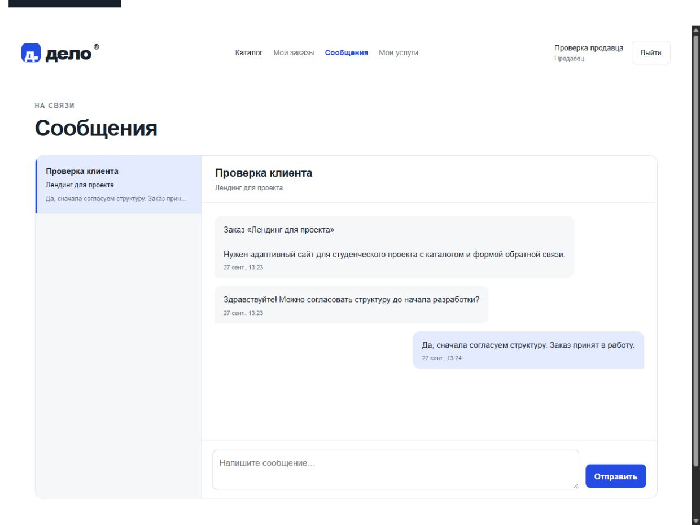
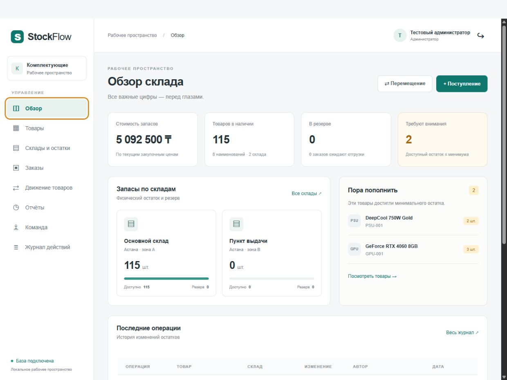
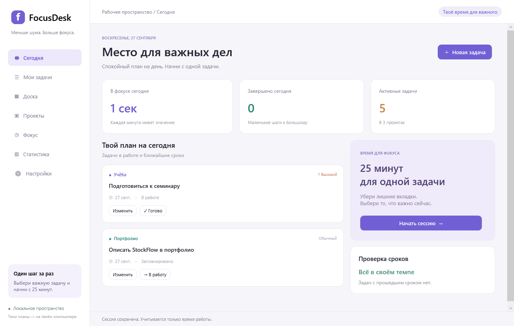
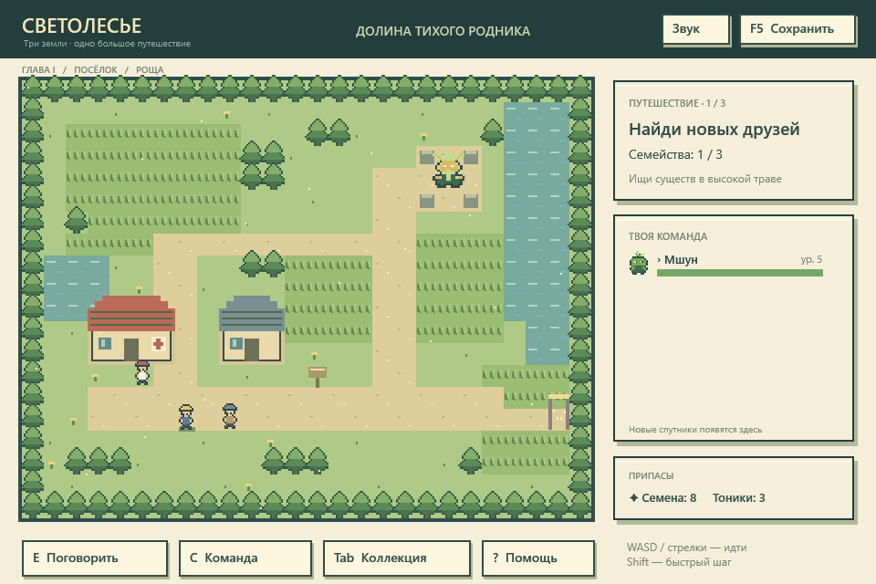
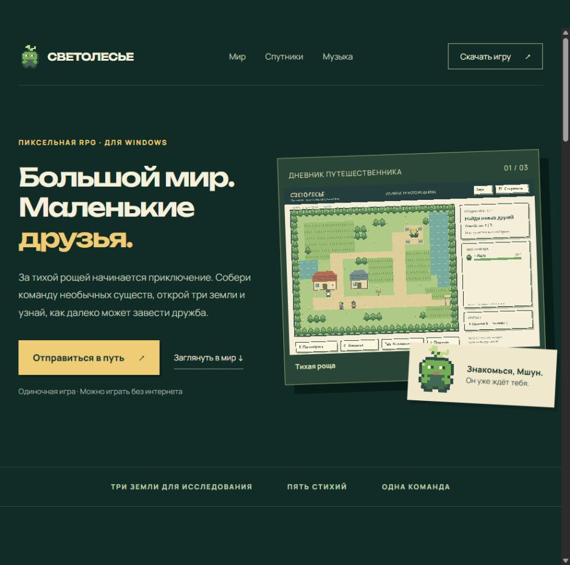
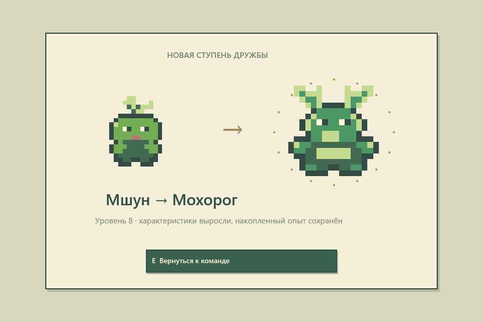
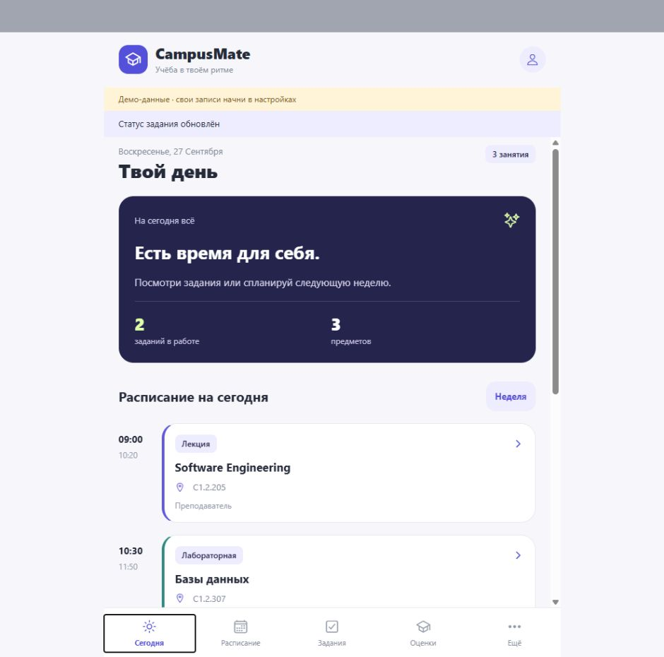
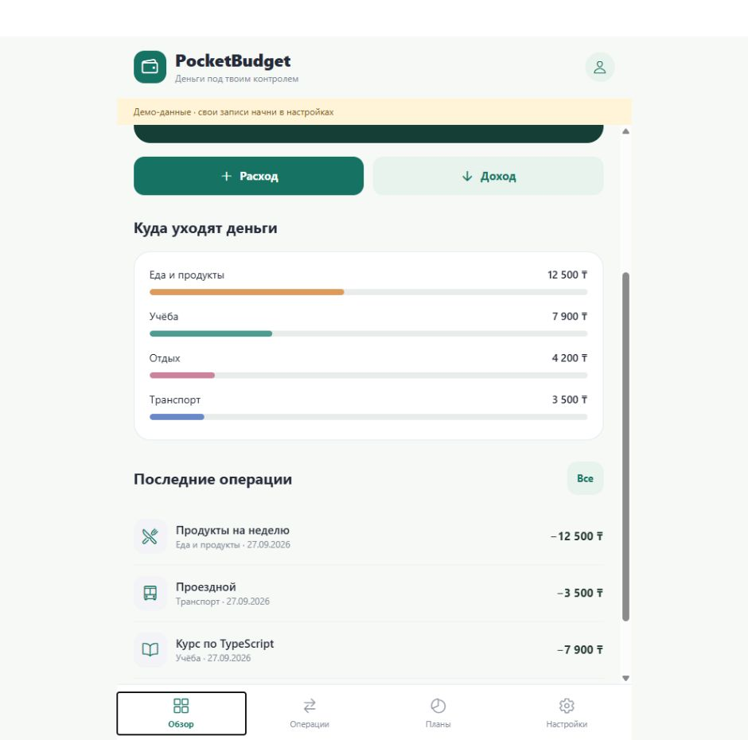

<div align="center">

# Software Portfolio

**Веб-сервисы · Windows-приложения · Мобильная разработка · 2D-игра**

Портфолио [aokoshi](https://github.com/aokoshi) — студента Software Engineering в Astana IT University.

[Проекты](#проекты) · [Быстрый запуск](docs/QUICKSTART.md) · [Архитектура](docs/ARCHITECTURE.md) · [Проверки](docs/VERIFICATION.md)


</div>

Семь учебных проектов с интерфейсами, прикладной логикой, хранением данных и автоматическими проверками. Колледж по разработке ПО, дополнительное образование по веб-разработке; сейчас — второй курс университета. Интересует первая работа в разработке, которую можно совмещать с учёбой.

This repository brings together seven learning projects across web, desktop, mobile, and game development. Each project includes source code and setup instructions. The application interfaces and detailed documentation are in Russian.

## Проекты

| Проект | Что решает | Технологии | Что посмотреть в коде |
|---|---|---|---|
| [Дело](delo-services) | Заказ цифровых услуг и общение с продавцами | Node.js 24, SQLite, JavaScript | Роли, сессии, изоляция чатов, жизненный цикл заказа |
| [StockFlow](stockflow) | Складской учёт и резервирование товаров | PHP 8.2, MySQL/MariaDB, PDO | Транзакции, блокировки остатков, повторяемость команд |
| [FocusDesk](FocusDesk) | Задачи, проекты и время концентрации | C#, .NET 10, WPF, SQLite | Таймер, контрольные точки, резервные копии |
| [Светолесье](Svetolesye) | RPG с исследованием и развитием команды | C#, .NET 10, WPF | Бои, XP, эволюции, миграция сохранений, синтез звука |
| [Сайт игры](Svetolesye-site) | Представление мира и механик «Светолесья» | HTML, CSS, JavaScript | Адаптивность, переключение контента, аудио |
| [CampusMate](CampusMate) | Учебное расписание, задания и оценки | React Native, Expo, TypeScript | Пересечения занятий, расчёт оценок, локальное хранение |
| [PocketBudget](PocketBudget) | Личные доходы, расходы и накопления | React Native, Expo, TypeScript | Суммы в целых тиынах, месячные лимиты, CSV/JSON |

### Дело — площадка цифровых услуг

Аккаунты клиента и продавца, поиск и фильтры, создание услуг с готовыми логотипами, заказы и личные сообщения. Цена фиксируется в заказе; доступ к переписке проверяется на сервере.



### StockFlow — управление запасами

Несколько складов, роли сотрудников, поступления, перемещения, резервирование и отгрузка. Тест на два одновременных заказа проверяет продажу последней единицы товара.



### FocusDesk — рабочий день в одном окне

Задачи и проекты, доска статусов, фокус-сессии, статистика и резервное копирование. Таймер сохраняет состояние и учитывает паузы.



### Светолесье — путешествие трёх земель

Три региона, пошаговые бои, приручение существ, опыт и пять цепочек эволюций. Пиксельные рисунки и процедурно синтезированный звук находятся в проекте.



<details>
<summary>Сайт игры и дополнительные экраны</summary>




</details>

### CampusMate и PocketBudget — приложения для повседневных задач

Оба проекта работают локально, поддерживают JSON-копии и имеют web-версию. CampusMate помогает с расписанием и дедлайнами; PocketBudget показывает расходы по категориям и прогресс накоплений.

<table><tr>
<th>CampusMate</th><th>PocketBudget</th>
</tr><tr>
<td></td>
<td></td>
</tr></table>

## Начать знакомство

```sh
git clone https://github.com/aokoshi/software-portfolio.git
cd software-portfolio/delo-services
node server.mjs
```

Для этого примера нужен Node.js 24+. Откройте http://127.0.0.1:4173 и создайте первый аккаунт. База создаётся автоматически; заранее заданных общих паролей нет.

Для остальных проектов: [инструкция запуска](docs/QUICKSTART.md). У каждого проекта свои зависимости; устанавливать все среды разработки сразу не требуется.

## Статус и границы

Это учебные MVP, созданные с помощью AI-инструментов, а не описание коммерческого опыта. Реализованные возможности, ограничения и проверки документированы в каждой папке. Скриншоты используют демонстрационные данные; экраны WPF получены встроенной отрисовкой интерфейса.

Пользовательские базы, переписка, финансовые записи, сохранения игр, локальные настройки и установленные зависимости не входят в репозиторий. Мобильные приложения не подключены к банкам или университету, не синхронизируют данные между друзьями и пока не выпущены в App Store. Подписанные iOS/Android-сборки не создавались.

Для связи: [профиль GitHub](https://github.com/aokoshi). Ошибки и предложения можно описать в Issues.
